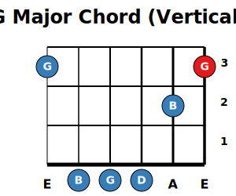
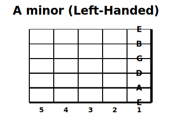
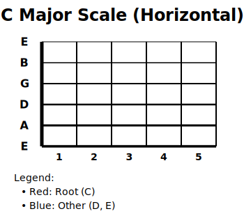

# Guitar Fretboard (Python)

This project is a **pure Python library** for generating high-quality guitar fretboard diagrams. It produces standalone SVG diagrams with zero external dependencies.

## ✨ Features
*   **Interactive Web Console**: Real-time fretboard where you can click to add/remove notes.
*   **Musical Intelligence**: 
    *   **Live Chord Detection**: Instantly identifies over 50 chord types, including Jazz and altered voicings (9th, 11th, 13th, 7b9, etc.).
    *   **Scale & Arpeggio Engine**: Generates full patterns (Major, Minor, Pentatonic, Harmonic Minor, Melodic Minor, and Symmetric scales).
    *   **Dynamic UI**: Headers and titles automatically adapt based on the active mode (Scale/Arp/Chord).
*   **Visual Enhancements**:
    *   **Note Coloring (A-G)**: Optional standardized visual coding for easier identification (A=Red, B=Orange, etc.).
    *   **Flexible Themes**: Light, Dark, Vintage, and Minimalist styles.
*   **CAGED System Support**: Filter scales using the 5 classic CAGED positions.
*   **Standard Parity**: Supports Chord mode (vertical), Left-handed mode, Split notes, Highlights, and Legends.
*   **Multi-Platform**: CLI Tool, FastAPI Interactive App, and standard Streamlit interface.

## 🚀 Installation

It is recommended to use a Python virtual environment.

```bash
# Install the package in editable mode
pip install -e .

# Install web dependencies (FastAPI, Uvicorn)
pip install fastapi uvicorn
```

---

## 💻 1. Interactive Web Application (FastAPI)

The primary interface for the project is a modern, real-time web application.

```bash
uvicorn web.main:app --reload
```
Open **http://127.0.0.1:8000** in your browser to start clicking notes and exploring scales!

### Feature Highlight: Manual Mode & Chord Detection
Even when exploring a specific scale, you can **manually add or remove notes** by clicking on the fretboard. The application will asynchronously communicate with the backend to guess the chord name in real-time at the top of the screen.

---

## 📊 2. Classic Web Application (Streamlit)

A legacy form-based version is also available:
```bash
streamlit run app.py
```
This will open a new tab in your browser where you can instantly preview and download your SVG diagrams.

---

## 🖥️ 2. Command Line Interface (CLI)

You can generate diagrams directly from your terminal using the `guitarfretboard` command.

**Basic Scale Generation:**
```bash
# Generate a G Major scale diagram
guitarfretboard --root "G" --scale "M" --output g_major.svg
```

**Available Options:**
* `--scale`: Scale type (e.g., 'M', 'm', 'p', 'M7')
* `--root`: Root note (e.g., 'C', 'G#')
* `--output`: Output file name (default: `fretboard.svg`)
* `--chord`: Render the diagram vertically (for chord boxes)
* `--left`: Render for left-handed players
* `--frets`: Number of frets to display (default: 5)
* `--tuning`: Instrument tuning (`standard`, `dadgad`, `drop d`, `bass standard`, `ukulele standard`, etc.)

**Example for a Bass:**
```bash
guitarfretboard --root "E" --scale "m" --tuning "standard bass" --output e_minor_bass.svg
```

---

## 🐍 3. Python API Usage

You can use the library directly inside your own Python scripts for maximum control.

### Example A: Drawing a Custom Scale
```python
from guitarfretboard import Fretboard, render_svg
from guitarfretboard.core import TUNINGS_GUITAR
from guitarfretboard.notes import parse_pitch, parse_interval
from guitarfretboard.scales import get_scale_intervals

# 1. Initialize the fretboard
fb = Fretboard(
    frets_min=0, frets_max=5, 
    tuning=TUNINGS_GUITAR["standard"],
    title="A Minor Pentatonic"
)

# 2. Add notes
root_pitch = parse_pitch("A")
intervals = get_scale_intervals("mP") # Minor Pentatonic

for interval in intervals:
    semitones = parse_interval(interval)
    pitch = (root_pitch + semitones) % 12
    # Highlight the root note
    style = "5" if semitones == 0 else "2" 
    fb.add_note(pitch, style=style)

# 3. Render
render_svg(fb, "a_minor_penta.svg")
```

### Example B: Using the Chord Dictionary & Musical Intelligence
```python
from guitarfretboard import Fretboard, render_svg, CHORD_SHAPES

fb = Fretboard(chord=True, frets_max=5) # 'chord=True' makes it vertical

# Use a predefined 'A minor' barre shape, placed at the 2nd fret (making it B minor)
minor_barre_shape = CHORD_SHAPES["minor"]["barre_a"]
fb.add_chord(minor_barre_shape, base_fret=2, style="5")

# The library can automatically identify the chord you just drew!
identified_name = fb.identify_chord()
fb.title = f"Detected: {identified_name}" # Will show "Detected: B minor"

render_svg(fb, "b_minor_barre.svg")
```

---

## 📸 Feature Showcase

| Chord Mode (Vertical) | Left-Handed Mode |
| :---: | :---: |
|  |  |

| Split Notes & Styles | Automated Legend |
| :---: | :---: |
|  |  |

---

## 🗺️ Roadmap & Future Improvements

While the core engine is now robust and professional, the following features are planned for future releases:

1.  **Audio Feedback**: Integration of the Web Audio API to hear notes and chords when clicking on the fretboard.
2.  **Smart Accidentals**: An intelligent engine to automatically toggle between Sharps (`#`) and Flats (`b`) based on the harmonic context of the selected scale.
3.  **Advanced Export**: A direct "Export as PNG/PDF" button in the web interface (currently available via CLI).
4.  **Mobile Optimization**: Refining the touch interface for use on tablets and smartphones during practice sessions.
5.  **Chord Progression Builder**: A tool to chain multiple fretboard diagrams together to visualize a full song or sequence.

## 📜 License

Copyright 2024 patlegu

Licensed under the Apache License, Version 2.0 (the "License");
you may not use this file except in compliance with the License.
You may obtain a copy of the License at

    http://www.apache.org/licenses/LICENSE-2.0

Unless required by applicable law or agreed to in writing, software
distributed under the License is distributed on an "AS IS" BASIS,
WITHOUT WARRANTIES OR CONDITIONS OF ANY KIND, either express or implied.
See the License for the specific language governing permissions and
limitations under the License.
