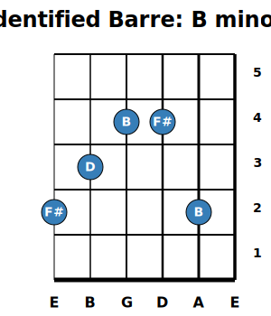

# Guitar Fretboard

The `guitar-fretboard` package generates high-quality guitar fretboard diagrams.

## 🎸 Python Fretboard (Standalone)

This project is a **pure Python library** for generating high-quality guitar fretboard diagrams. It produces standalone SVG diagrams with zero external dependencies (no LaTeX required).

### ✨ Features
*   **Zero Dependencies**: Generates pure SVG diagrams with pure Python.
*   **Musical Intelligence**: 
    *   **Chord Detection**: Automatically identifies chord names and inversions from notes on the fretboard.
    *   **Chord Dictionary**: Easy placement of common shapes (Major, Minor, 7ths, Barre chords).
*   **Modern Interfaces**:
    *   **CLI Tool**: Create diagrams directly from your terminal.
    *   **Web App**: Interactive Streamlit application for real-time preview (see `app.py`).
*   **Full Parity**: Supports Chord mode (vertical), Left-handed mode, Split notes, Highlights, and Shaded notes.

### 🚀 Getting Started

1.  **Install**:
    ```bash
    pip install -e .
    ```
2.  **Usage (CLI)**:
    ```bash
    guitarfretboard --root "G" --scale "M" --output scale.svg
    ```
3.  **Usage (Web)**:
    ```bash
    streamlit run app.py
    ```

### 📸 Examples

| Chord Mode (Vertical) | Left-Handed Mode |
| :---: | :---: |
|  |  |

| Split Notes & Highlights | Chord Detection |
| :---: | :---: |
|  |  |

---

## 📄 LaTeX Usage (Legacy)

The original LaTeX package can also be used to generate diagrams within documents.

### Usage Example
```latex
\documentclass[convert]{standalone}
\usepackage{guitar-fretboard}
\begin{document}
  \begin{fretboard}[frets before = 2, frets after = 2, transpose = 5, fret numbers]
    \foreach \i in { C, D, E, F, G, F, A, B} {
      \FBnote[split]{\i}
    }
  \end{fretboard}
\end{document}
```

---

## 📜 License

This program is free software. It comes without any warranty, to the extent permitted by applicable law. You can redistribute it and/or modify it under the terms of the **Do What The Fuck You Want To Public License, Version 2**, as published by Sam Hocevar. See [http://sam.zoy.org/wtfpl/COPYING](http://sam.zoy.org/wtfpl/COPYING) for more details.

This file may also be distributed and/or modified under the conditions of the **LaTeX Project Public License**, either version 1.3c or later.
